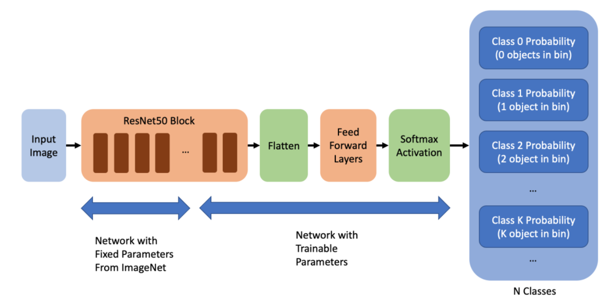
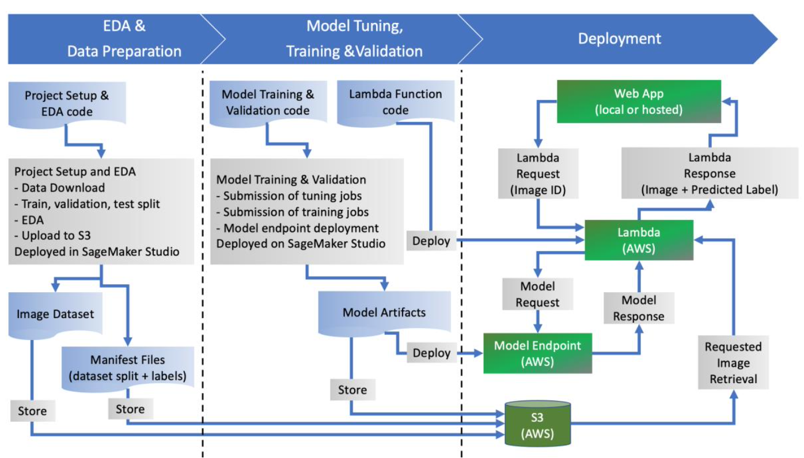

# cv-object-counter-app

## General Info

This project was created in January 2022 by Davide Martizzi as a Capstone Project for Udacity's AWS Machine Learning Engineer Nanodegree Program.

## Project Scope

The goal of this project is to solve a business problem related to inventory monitoring at distribution centers. Product distributions centers often use robots to move objects as a part of their operations. In order to obtain full automation of the process and assess whether robots are operating as intended, monitoring systems are deployed to perform quality control. One of the most basic applications for quality control is counting the number of objects in each bin without human involvement, e.g., by processing of images of each bin.

In this project, a deep-learning-based computer vision model to count the number of objects in bins was developed and deployed on AWS, and its predictions were made accessible via a web app. The latter is currently available for local deployment.

## Problem Statement

Formally, the problem falls in the realm of weakly-supervised object detection, the main task being the identification and counting of objects in bins within a distribution center using images. The task is weakly-supervised because it’s difficult to get detailed annotations for the bounding-box position and label of objects in the images, which are typically required to train most object detection models. 

However, since we are only interested in the count of objects in each bin, some of the complexity of identifying the correct location and label for each object can be dropped. This should allow me to choose simpler model architectures and use weaker labels to perform the task. 

The model taked images as an input and yield the count of objects in the image as an output.

## Datasets and Inputs

The dataset that used for this project is the Amazon Bin Image Dataset: https://github.com/awslabs/open-data-docs/tree/main/docs/aft-vbi-pds [3]. The dataset contains > 500,000 bin JPEG images and corresponding JSON metadata files describing items in the bin. Among the metadata is the count of the number of objects in each bin, which can be used to define target labels for the machine learning problem. 

Due to the large size of the dataset and to the constraints in terms of budget and time, the dataset was too big to be fully utilized. For this reason, a subsample of ~50,000 images with object counts from 0 to 5 was randomly selected from the original dataset. This random subsample was split in training, validation, and test subsets, which were stored on AWS S3. 

## Solution Statement

The model used to solve this problem is a variant of the approach implemented in https://github.com/silverbottlep/abid_challenge. The idea is to reduce the object count problem to an image classification model in which the class corresponds to the count of objects in the image. In this implementation, the weights of the pre-trained ResNet50 classifier for ImageNet were loaded, and only train the deepest layers of the network plus the custom output layers, specifically the last 3 blocks of the ResNet50 architecture. With this approach, one can in principle leverage the low-level image features extracted from image classification and re-purpose the rest of the network for object identification and counting. The output layer yields a softmax distribution over the possible values of a class label corresponding to the number of objects in the image. 

The architecture of the model is shown below. 



Once deployed on AWS, the model is accessible via a web app where a user would be able to select the ID of one of the images in the test set. The client only maintains a list of the IDs of the images in the test set. The client sends a JSON request to a lambda function which retrieves the image stored on S3 and pass it to a model endpoint. The model yields the inferred number of objects in the image, which is sent by the lambda function back to the client together with the image. Finally, the client visualize the image and the inferred number of objects. 

## Benchmark Model

The benchmark model chosen for this project is based on pre-trained ResNet models with custom output layers. This approach is inspired by the following implementation of a solution to the same problem: https://github.com/silverbottlep/abid_challenge. This implementation achieves an accuracy of 55.67% and a RMSE of 0.93.

In the benchmark implementation, the model is trained from scratch and uses ResNet34, whereas in this implementation the weights of the pre-trained ResNet50 classifier for ImageNet are loaded, and only the deepest layers of the network plus the custom output layers are trained.

As in the reference implementation, only images with 0 to 5 objects in the bin are considered.

## Evaluation Metrics 

The evaluation metrics chosen for this task are:
1. The accuracy in retrieving the exact number of objects in the image.
2. The RMSE obtained by comparing the inferred number of objects with the true one. 
The metrics are tracked for training and validation sets during hyperparameter optimization sweeps. The same metrics are then used to evaluate the best model but computed on the test set. 

## Deployment Architecture

The design of the project, timeline, workflow, general architecture of the system, and visualization of the components that need to be developed is summarized in the figure below. 



The architecture of the system is very simple, and the main advantage of adopting this approach lies in the use of transfer learning to speed up the model training process while achieving competitive performance. Although simple, this architecture is relatively scalable, because it allows to take advantage of both lambda function concurrency settings and endpoint autoscaling.

## Exploratory Data Analysis (EDA) - Results 

EDA code can be found in the `eda` folder, including the `eda/eda_preprocessing.ipynb` notebook, which contains details of the analysis. 

Main findings: 
- The dataset is not fully balanced across the 6 classes chosen for training (0-5 items in the bin).
- The randomized 80:10:10 training, validation, testing split yields similar class distributions across the three different sets.
- Images are in standard JPEG format, with three RGB channels and pixel values 0-255.
- Images have variable height and width in terms of number of pixels; they need to be rescaled to a fixed size before being fed to the model.


See `eda/eda_preprocessing.ipynb` for more details.

## Model Training - Results

Code related to training and deployment of the model can be found in the `ml_model` folder, including the `ml_model/train_and_deploy.ipynb`, which contains code to launch hyperparameter tuning jobs, training jobs, and which deploys and tests endpoints.

Main findings:
- Hyperparameter optimization was used to validate the model and set hyperparameters that yield best performance in terms of minimizing the loss function computed on the validation set. Validation loss = 1.3095589876174927.
- Training of the best model for 50 epochs takes > 6 hours. 
- The model was tested on the test set, yielding 
    - Test Loss Function = 1.2321901550263372.
    - Test RMSE = 1.1540604249432982.
    - Test Accuracy = 0.43515850144092216 
- The model trained in this project has slightly worse performance than the baseline model propsed by https://github.com/silverbottlep/abid_challenge (Accuracy = 0.5567, RMSE = 0.930), however the differences can be attributed to multiple factors: 
    - The authors of the baseline model use the full image dataset with >500,000 images. They have ~10x more training examples than in this project that uses a random subsample of ~50,000 images. 
    - They train a ResNet model from scratch. In this project, transfer learning was performed, with a large part of the ResNet50 neural network whose parameters were frozen. For this reason, the baseline model is probably capable of extracting better features than in the transfer learning model trained here.
    - This project was performed with a tight limit on the training time and budget. 


See `ml_model/train_and_deploy.ipynb` for more details.

## Repo Catalog

The main folders and files in this repository are:

- `eda` folder: EDA code. Run in SageMaker Studio.
    - `eda/eda_preprocessing.ipynb`: main notebook to perform data download to S3, EDA and preprocessing. Run in SageMaker Studio.
    - `eda/eda_utils.py`: utilities used in the notebook.


- `ml_model` folder: training, validation and deployment code. Run in SageMaker Studio.
    - `ml_model/train_and_deploy.ipynb`: main notebook to launch tuning, training and deployments. 
    - `ml_model/hyperparameter_opt.py`: entrypoint for hyperparameter tuning.
    - `ml_model/train.py`: entrypoint for best model training.
    - `ml_model/inference.py`: entrypoint for model deployment to endpoint.


- `lambda_function` folder: Lambda function. Deploy from AWS Console.
    - `lambda_function/lambda_function.py`: code of the Lambda function that serves the model to the web app.


- `web_app` folder: locally deployed web app code.
    - `web_app/views.py`: code 
    - `web_app/utils.py`: 


- `/` folder: web app launcher and requirements.
    - `web_app.py`: main script to launch the Flask web app locally.
    - `web_app_requirements.txt`: requirements for local web app deployment.
    - `cv-object-counter-app_demo.mov`: a short video demonstrating how the app works.
    
    
- `proof_of_deployment` folder: various snapshots taken during different stages of the workflow.
    
## Instructions for Deployment

The following steps recommended to reproduce the results are recommended

1. Setup a SageMaker Studio server from the AWS Console.


2. Assign policies that grant S3 and Lambda access to the SageMaker execution role. In particular:
    - Permissions to create S3 buckets.
    - Permissions to read from and write to S3 buckets.
    - Permissions to invoke Lambda functions.


3. Assign policies that grant S3 and SageMaker access to Lambda. In particular:
    - Lambda functions should be able to retrieve data from S3.
    - Lambda functions should be able to invoke SageMaker inference endpoints.


4. Initialize a Python `datascience-1.0` kernerl running on an `ml.t3.medium` instance.


5. From SageMaker Studio, run the code in the `eda/eda_preprocessing.ipynb` notebook to 
    - Create an S3 bucket for the images.
    - Create a random subsample of indexes from 0 to 499,000. 
    - Download only the images and metadata with selected indexes to S3.
    - Perform EDA.


6. From SageMaker Studio, run the code in the `ml_model/train_and_deploy.ipynb` to
    - Create an S3 bucket for the model artifacts.
    - Perform hyperparameter tuning.
    - Train the with the best set of hyperparameters. 
    - Deploy the best model to a SageMaker inference endpoint.


7. Deploy a Lambda function located in `lambda_function/lambda_function.py` from the AWS Console.


8. Test the Lambda function from 
    - The automated tests in the Lambda console.
    - The last few cells `ml_model/train_and_deploy.ipynb` notebook. 


9. Make sure that the Python packages in `web_app_requirements.txt` are installed on your local machine.


10. Make sure that 
    - Your local machine has AWS CLI installed and that your user credentials are valid. 
    - That your AWS user account has permission to invoke Lambda functions. 


10. Launch the Flask web app on your local machine with the following command

    ```
    python web_app.py \
      --endpoint_name <name of your endpoint> \
      --lambda_function_name <lambda function name> \
      --s3_bucket <name of S3 bucket where images are stored> \
      --s3_prefix <prefix within the S3 bucket where images are stored>
    ```


11. Open the web app URL in your browser and have fun!


## Play the video demo

A short video demo is provided by this file in the root folder: `cv-object-counter-app_demo.mov`.